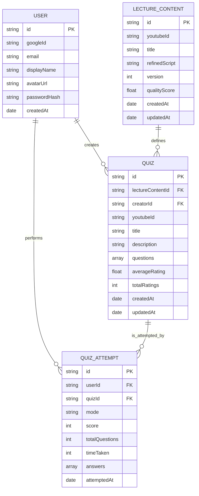
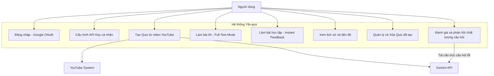
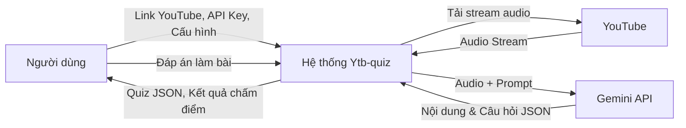
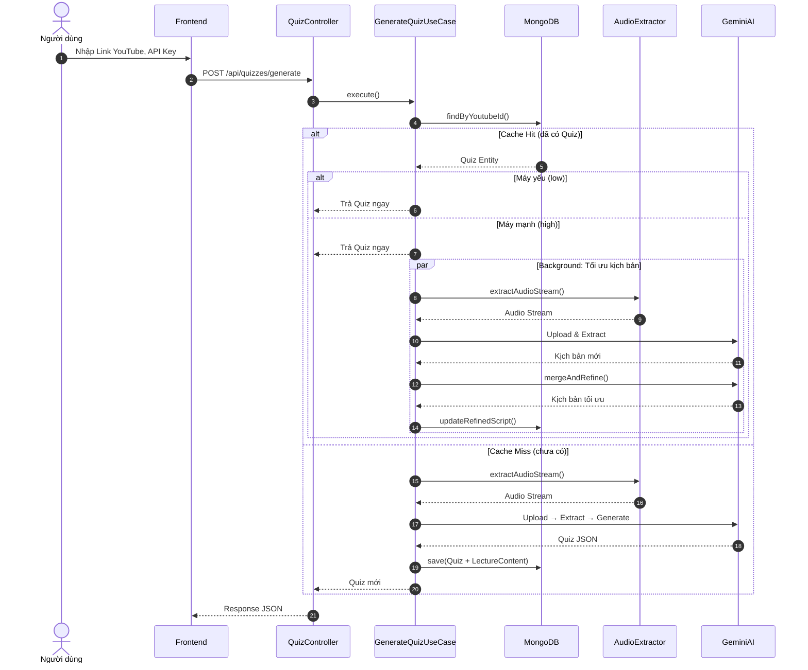
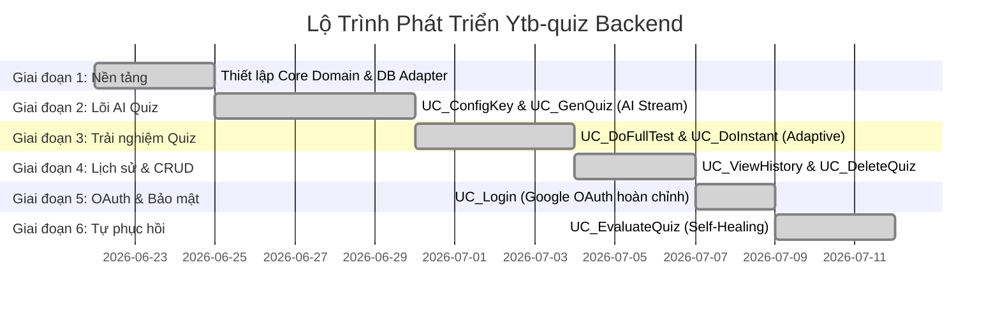

# 🎓 Ytb-quiz — Backend Server

> **Biến mọi video YouTube thành bài trắc nghiệm tương tác bằng sức mạnh AI.**

Ytb-quiz Backend là một REST API server được xây dựng trên **Node.js / Express / TypeScript** theo nguyên tắc **Clean Architecture (Hexagonal Architecture)**. Hệ thống tải audio stream từ YouTube, sử dụng **Google Gemini AI** để trích xuất nội dung bài giảng và tự động sinh bộ câu hỏi trắc nghiệm chất lượng cao.

---

## 📑 Mục Lục

- [Tổng Quan Tính Năng](#-tổng-quan-tính-năng)
- [Kiến Trúc Hệ Thống](#-kiến-trúc-hệ-thống)
- [Công Nghệ Sử Dụng](#-công-nghệ-sử-dụng)
- [Cấu Trúc Thư Mục](#-cấu-trúc-thư-mục)
- [Yêu Cầu Hệ Thống](#-yêu-cầu-hệ-thống)
- [Hướng Dẫn Cài Đặt & Chạy](#-hướng-dẫn-cài-đặt--chạy)
- [Biến Môi Trường](#-biến-môi-trường)
- [API Reference](#-api-reference)
- [Custom Headers](#-custom-headers)
- [Xử Lý Lỗi](#-xử-lý-lỗi)
- [Thiết Kế Hệ Thống](#-thiết-kế-hệ-thống)
- [Cơ Chế Đặc Biệt](#-cơ-chế-đặc-biệt)
- [Kiểm Thử](#-kiểm-thử)
- [Lộ Trình Phát Triển](#-lộ-trình-phát-triển)

---

## ✨ Tổng Quan Tính Năng

| # | Tính năng | Mô tả |
|---|-----------|-------|
| 1 | **Đăng nhập Google OAuth** | Xác thực người dùng qua Google, cấp JWT token cho phiên làm việc |
| 2 | **Xác thực API Key Gemini** | Kiểm tra tính hợp lệ của khóa API cá nhân trước khi sử dụng |
| 3 | **Sinh Quiz từ YouTube** | Tải audio → AI trích xuất nội dung → AI sinh câu hỏi trắc nghiệm JSON |
| 4 | **Làm bài Full Test** | Chế độ thi thử: trả lời tất cả rồi nộp bài, nhận kết quả tổng quan |
| 5 | **Làm bài Instant Feedback** | Chế độ học tập: biết đúng/sai và giải thích ngay sau mỗi câu |
| 6 | **Lịch sử & Thống kê** | Xem lại các lượt làm bài, biểu đồ tiến độ học tập |
| 7 | **Xóa Quiz** | Quản lý và xóa bài trắc nghiệm đã tạo (kiểm tra quyền sở hữu) |
| 8 | **Đánh giá câu hỏi** | Vote tốt/xấu cho từng câu hỏi |
| 9 | **Tự phục hồi (Self-Healing)** | Tự động phát hiện và thay thế câu hỏi lỗi bằng AI |
| 10 | **Thích ứng hiệu năng** | Tối ưu phản hồi dựa trên cấu hình thiết bị của người dùng |

---

## 🏛 Kiến Trúc Hệ Thống

Dự án tuân thủ **Clean Architecture / Hexagonal Architecture** với 4 tầng độc lập, phụ thuộc hướng vào trong:

```
┌─────────────────────────────────────────────────────────────┐
│                    Presentation Layer                        │
│   Controllers · Middlewares · Zod Validation · Routes        │
├─────────────────────────────────────────────────────────────┤
│                   Infrastructure Layer                       │
│   MongoDB Adapters · Gemini AI · YouTube Audio · JWT/OAuth   │
├─────────────────────────────────────────────────────────────┤
│                    Application Layer                         │
│   Use Cases · DTOs · Ports (Interfaces) · Mappers            │
├─────────────────────────────────────────────────────────────┤
│                      Domain Layer                            │
│   Entities · Value Objects · Business Exceptions             │
│              (Pure TypeScript, Zero Dependencies)             │
└─────────────────────────────────────────────────────────────┘
```

**Nguyên tắc ràng buộc:**
- **Domain Layer** — Tuyệt đối không import thư viện ngoài. Chỉ TypeScript thuần.
- **Application Layer** — Chỉ phụ thuộc Domain. Giao tiếp bên ngoài qua Ports (Interfaces).
- **Infrastructure & Presentation** — Chứa toàn bộ thư viện ngoài và chi tiết kỹ thuật.

---

## 🛠 Công Nghệ Sử Dụng

### Runtime & Language
| Công nghệ | Phiên bản | Vai trò |
|------------|-----------|---------|
| **Node.js** | ≥ 18 | Runtime JavaScript |
| **TypeScript** | ^5.4.5 | Ngôn ngữ lập trình (Strict mode) |

### Backend Framework & Libraries
| Thư viện | Phiên bản | Vai trò |
|----------|-----------|---------|
| **Express** | ^4.19.2 | Web framework REST API |
| **Mongoose** | ^8.4.1 | ODM kết nối MongoDB |
| **Zod** | ^3.23.8 | Validation schema đầu vào |
| **jsonwebtoken** | ^9.0.2 | Sinh và xác thực JWT token |
| **cors** | ^2.8.5 | Cấu hình CORS |
| **dotenv** | ^16.4.5 | Quản lý biến môi trường |

### AI & Media Processing
| Thư viện | Phiên bản | Vai trò |
|----------|-----------|---------|
| **@google/genai** | ^2.9.0 | SDK Google Gemini AI |
| **@distube/ytdl-core** | ^4.15.8 | Tải audio stream YouTube vào RAM |

### Development Tools
| Thư viện | Vai trò |
|----------|---------|
| **ts-node-dev** | Hot-reload TypeScript trong development |
| **rimraf** | Dọn sạch thư mục build |

### Infrastructure
| Công nghệ | Vai trò |
|------------|---------|
| **MongoDB** | Cơ sở dữ liệu NoSQL |
| **Docker / Docker Compose** | Khởi chạy MongoDB + Mongo Express cục bộ |
| **Google OAuth 2.0** | Xác thực người dùng |
| **Google Gemini API** | Trích xuất nội dung & sinh câu hỏi bằng AI |

---

## 📁 Cấu Trúc Thư Mục

```
server/
├── src/
│   ├── domain/                     # 🟢 Tầng Nghiệp Vụ Cốt Lõi
│   │   ├── model/                  #    Entities: User, Quiz, LectureContent, QuizAttempt
│   │   ├── valueobject/            #    Value Objects: YoutubeUrl
│   │   ├── exception/              #    Business Exceptions
│   │   └── __tests__/              #    Unit tests Domain
│   │
│   ├── application/                # 🔵 Tầng Logic Ứng Dụng
│   │   ├── usecase/                #    Use Cases (logic nghiệp vụ)
│   │   │   └── __tests__/          #    Unit tests Use Cases
│   │   ├── port/                   #    Interfaces (Contracts)
│   │   │   ├── input/              #    Input Ports
│   │   │   └── output/             #    Output Ports (Repository, AI, Audio, Auth)
│   │   └── dto/                    #    Data Transfer Objects
│   │
│   ├── infrastructure/             # 🟠 Tầng Hạ Tầng
│   │   ├── persistence/            #    MongoDB Schemas, Mappers, Repository Adapters
│   │   │   ├── schema/             #    Mongoose Schema definitions
│   │   │   ├── mapper/             #    Domain ↔ Document mappers
│   │   │   └── adapter/            #    MongoXxxRepository implementations
│   │   ├── ai/                     #    GeminiAIService adapter
│   │   ├── audio/                  #    YtdlAudioExtractor adapter
│   │   ├── security/               #    GoogleOAuthService, JwtAuthTokenService
│   │   └── __tests__/              #    Integration tests Infrastructure
│   │
│   └── presentation/               # 🔴 Tầng Giao Tiếp Ngoài
│       ├── controller/             #    REST Controllers (Auth, Config, Quiz, Attempt, User)
│       ├── middleware/              #    ErrorHandler, AuthMiddleware, GeminiKeyMiddleware, validateRequest
│       ├── app.ts                  #    Entry point — Bootstrap Express server
│       └── __tests__/              #    Integration tests API endpoints
│
├── docs/
│   └── system-design/              # 📐 Tài liệu thiết kế hệ thống
│       ├── use_case.md             #    Sơ đồ ca sử dụng
│       ├── erd.md                  #    Sơ đồ quan hệ thực thể
│       ├── class.md                #    Sơ đồ lớp (Clean Architecture)
│       ├── dfd.md                  #    Sơ đồ luồng dữ liệu (Cấp 0 & 1)
│       ├── sequence.md             #    Sơ đồ tuần tự (Adaptive Quiz Flow)
│       ├── activity.md             #    Sơ đồ hoạt động (Full Test & Instant Feedback)
│       └── roadmap.md              #    Lộ trình phát triển
│
├── docker-compose.yml              # Docker: MongoDB + Mongo Express
├── package.json                    # Dependencies & npm scripts
├── tsconfig.json                   # TypeScript config (strict: true)
├── .env                            # Biến môi trường (local)
├── project_rule.md                 # Quy tắc kiến trúc & coding standards
├── agents.md                       # Hướng dẫn cho AI Agents
├── backend-info.md                 # API spec dành cho Frontend
├── mistake.md                      # Tổng hợp sai lầm cần tránh
└── file-info.md                    # Cache mô tả file cho AI Agents
```

---

## 📋 Yêu Cầu Hệ Thống

- **Node.js** >= 18.x
- **npm** >= 9.x
- **Docker** & **Docker Compose** (để chạy MongoDB cục bộ)
- **Google Gemini API Key** (lấy tại [Google AI Studio](https://aistudio.google.com/))
- **Google OAuth Client ID & Secret** (tạo tại [Google Cloud Console](https://console.cloud.google.com/))

---

## 🚀 Hướng Dẫn Cài Đặt & Chạy

### 1. Clone dự án

```bash
git clone https://github.com/<your-org>/Ytb-quiz.git
cd Ytb-quiz/server
```

### 2. Cài đặt dependencies

```bash
npm install
```

### 3. Khởi chạy MongoDB bằng Docker

```bash
docker compose up -d
```

Lệnh này sẽ khởi động:
- **MongoDB** tại `localhost:27017`
- **Mongo Express** (admin UI) tại `http://localhost:8081`

### 4. Cấu hình biến môi trường

Sao chép file `.env` mẫu và điền các giá trị thực:

```bash
cp .env .env.local  # Hoặc chỉnh sửa trực tiếp .env
```

```env
PORT=5000
MONGODB_URI=mongodb://localhost:27017/ytb-quiz
JWT_SECRET=your-strong-jwt-secret-key
GOOGLE_CLIENT_ID=your-google-client-id.apps.googleusercontent.com
GOOGLE_CLIENT_SECRET=your-google-client-secret
FRONTEND_URL=http://localhost:5173
```

### 5. Chạy server ở chế độ Development

```bash
npm run dev
```

Server sẽ khởi động tại `http://localhost:5000` với hot-reload.

### 6. Kiểm tra server hoạt động

```bash
curl http://localhost:5000/health
```

Kết quả mong đợi:
```json
{ "status": "ok", "message": "Ytb-quiz backend is running." }
```

### 7. Build & chạy Production

```bash
npm run build    # Biên dịch TypeScript → dist/
npm start        # Chạy từ dist/app.js
```

---

## 🔐 Biến Môi Trường

| Biến | Bắt buộc | Mô tả | Giá trị mặc định |
|------|----------|-------|-------------------|
| `PORT` | Không | Cổng server | `5000` |
| `MONGODB_URI` | Có | Connection string MongoDB | `mongodb://localhost:27017/ytb-quiz` |
| `JWT_SECRET` | Có | Khóa bí mật ký JWT token | — |
| `GOOGLE_CLIENT_ID` | Có | Google OAuth Client ID | — |
| `GOOGLE_CLIENT_SECRET` | Có | Google OAuth Client Secret | — |
| `FRONTEND_URL` | Không | Origin frontend cho CORS | `http://localhost:5173` |

> ⚠️ **Lưu ý**: API Key Gemini **KHÔNG** lưu trên server. Người dùng truyền key cá nhân qua header `x-gemini-key` trong mỗi request để tránh cạn kiệt quota server.

---

## 📡 API Reference

### Base URL
```
http://localhost:5000
```

### Endpoints

#### 🟢 Health Check

```http
GET /health
```
```json
{ "status": "ok", "message": "Ytb-quiz backend is running." }
```

---

#### 🔑 Authentication

##### `POST /api/auth/google` — Đăng nhập Google OAuth

Đổi authorization code từ Google lấy JWT token hệ thống.

**Request Body:**
```json
{
  "code": "4/0AX4XfWi...",
  "redirectUri": "http://localhost:5173" // (Optional)
}
```

**Response (200):**
```json
{
  "success": true,
  "data": {
    "token": "eyJhbGciOi...",
    "user": {
      "id": "usr_abc123",
      "email": "user@example.com",
      "displayName": "John Doe",
      "avatarUrl": "https://lh3.googleusercontent.com/..."
    }
  }
}
```

---

#### ⚙️ Configuration

##### `POST /api/config/validate-key` — Xác thực Gemini API Key

**Headers:**
```http
x-gemini-key: YOUR_GEMINI_API_KEY
```

**Response (200):**
```json
{
  "success": true,
  "message": "Khóa API Gemini hoạt động tốt."
}
```

---

#### 📝 Quiz Management

##### `POST /api/quizzes/generate` — Sinh Quiz từ YouTube

**Headers:**
```http
x-gemini-key: YOUR_GEMINI_API_KEY         (Bắt buộc)
x-device-performance: high | low          (Tuỳ chọn, mặc định: low)
Authorization: Bearer <JWT_TOKEN>         (Tuỳ chọn)
```

**Request Body:**
```json
{
  "url": "https://www.youtube.com/watch?v=dQw4w9WgXcQ"
}
```

**Response (200 / 201):**
```json
{
  "success": true,
  "data": {
    "id": "quiz_123456",
    "lectureContentId": "lect_123456",
    "creatorId": "usr_abc123",
    "youtubeId": "dQw4w9WgXcQ",
    "title": "Tên Video YouTube",
    "description": "Mô tả bài trắc nghiệm",
    "questions": [
      {
        "id": "q_1",
        "text": "Nội dung câu hỏi?",
        "options": ["A", "B", "C", "D"],
        "correctOptionIndex": 1,
        "explanation": "Giải thích đáp án đúng.",
        "metrics": {
          "upvotes": 0,
          "downvotes": 0,
          "timesAnswered": 0,
          "timesCorrect": 0
        }
      }
    ],
    "averageRating": 0,
    "totalRatings": 0,
    "createdAt": "2026-06-23T08:44:39.000Z",
    "updatedAt": "2026-06-23T08:44:39.000Z"
  }
}
```

##### `DELETE /api/quizzes/:id` — Xóa Quiz

**Headers:**
```http
Authorization: Bearer <JWT_TOKEN>  (Tuỳ chọn)
```

**Query Params:** `userId` (fallback nếu không có JWT)

**Response (200):**
```json
{
  "success": true,
  "message": "Đã xóa bài trắc nghiệm thành công."
}
```

---

#### 📊 Quiz Attempts

##### `POST /api/quizzes/:id/attempts` — Nộp bài trắc nghiệm

**Headers:**
```http
Authorization: Bearer <JWT_TOKEN>  (Tuỳ chọn)
```

**Request Body:**
```json
{
  "answers": [
    { "questionId": "q_1", "selectedOptionIndex": 1 }
  ],
  "timeTaken": 45,
  "mode": "full-test"
}
```
> `mode` nhận giá trị `"full-test"` hoặc `"instant-feedback"`

**Response (201):**
```json
{
  "success": true,
  "data": {
    "attempt": {
      "id": "att_987654",
      "userId": "usr_abc123",
      "quizId": "quiz_123456",
      "mode": "full-test",
      "score": 1,
      "totalQuestions": 1,
      "timeTaken": 45,
      "answers": [
        { "questionId": "q_1", "selectedOptionIndex": 1, "isCorrect": true }
      ],
      "attemptedAt": "2026-06-23T08:45:00.000Z"
    },
    "questions": [
      {
        "id": "q_1",
        "text": "Nội dung câu hỏi?",
        "options": ["A", "B", "C", "D"],
        "correctOptionIndex": 1,
        "explanation": "Giải thích đáp án."
      }
    ]
  }
}
```

---

#### 👍 Question Voting (Self-Healing Trigger)

##### `POST /api/quizzes/:id/questions/:questionId/vote` — Đánh giá câu hỏi

**Headers:**
```http
x-gemini-key: YOUR_GEMINI_API_KEY  (Tuỳ chọn, cần cho Self-Healing)
Authorization: Bearer <JWT_TOKEN>  (Tuỳ chọn)
```

**Request Body:**
```json
{
  "type": "up"
}
```
> `type` nhận giá trị `"up"` hoặc `"down"`

**Response (200):**
```json
{
  "success": true,
  "message": "Đã biểu quyết câu hỏi thành công.",
  "data": { /* Updated Quiz structure */ }
}
```

---

#### 📈 User History & Statistics

##### `GET /api/users/history` — Lịch sử và thống kê học tập

**Headers:**
```http
Authorization: Bearer <JWT_TOKEN>  (Tuỳ chọn)
```

**Query Params:** `userId` (fallback nếu không có JWT)

**Response (200):**
```json
{
  "success": true,
  "data": {
    "attempts": [
      {
        "id": "att_987654",
        "quizId": "quiz_123456",
        "quizTitle": "Tên Video",
        "mode": "full-test",
        "score": 8,
        "totalQuestions": 10,
        "timeTaken": 120,
        "attemptedAt": "2026-06-23T08:45:00.000Z"
      }
    ],
    "stats": {
      "totalAttempts": 5,
      "totalQuizzes": 3,
      "averageCorrectRate": 75.5,
      "totalTimeTaken": 600
    }
  }
}
```

---

## 🏷 Custom Headers

| Header | Kiểu | Bắt buộc | Mô tả |
|--------|------|----------|-------|
| `x-gemini-key` | `string` | Có/Không | API Key Gemini cá nhân. **Bắt buộc** cho `/validate-key` và `/generate`. Server **không bao giờ** log giá trị này. |
| `x-device-performance` | `"high"` \| `"low"` | Không | Điều khiển luồng thích ứng hiệu năng. Mặc định `low`. |
| `Authorization` | `Bearer <token>` | Không | JWT token xác thực phiên người dùng. |

---

## ❌ Xử Lý Lỗi

Tất cả lỗi trả về theo cấu trúc JSON thống nhất:

### Business Exception (4xx)

```json
{
  "success": false,
  "code": "ERROR_CODE",
  "message": "Mô tả chi tiết lỗi."
}
```

| HTTP Status | Error Code | Mô tả |
|-------------|------------|-------|
| 401 | `AUTH_UNAUTHORIZED` | Token không hợp lệ, hết hạn hoặc thiếu |
| 403 | `QUIZ_FORBIDDEN` / `AUTH_FORBIDDEN` | Không có quyền thao tác tài nguyên |
| 404 | `QUIZ_NOT_FOUND` | Không tìm thấy bài trắc nghiệm |
| 400 | `QUESTION_NOT_FOUND` | Câu hỏi không tồn tại trong quiz |
| 400 | `INVALID_YOUTUBE_URL` | URL YouTube không đúng định dạng |
| 400 | `INVALID_GEMINI_API_KEY` | API Key Gemini trống hoặc không hợp lệ |
| 400 | `AUDIO_EXTRACTION_ERROR` | Không thể tải audio từ YouTube |
| 400 | `QUIZ_GENERATION_ERROR` | Lỗi sinh Quiz từ Gemini AI |

### Validation Error (400)

```json
{
  "success": false,
  "code": "VALIDATION_ERROR",
  "message": "Dữ liệu yêu cầu không hợp lệ",
  "errors": [
    { "field": "body.url", "message": "URL video YouTube là bắt buộc" }
  ]
}
```

### Internal Server Error (500)

```json
{
  "success": false,
  "code": "INTERNAL_SERVER_ERROR",
  "message": "Đã xảy ra lỗi hệ thống. Vui lòng thử lại sau."
}
```

---

## 📐 Thiết Kế Hệ Thống

### Sơ Đồ Quan Hệ Thực Thể (ERD)



### Sơ Đồ Ca Sử Dụng (Use Case)



### Sơ Đồ Luồng Dữ Liệu (DFD Cấp 0)



### Sơ Đồ Tuần Tự — Sinh Quiz Thích Ứng



> 📚 **Xem đầy đủ tài liệu thiết kế tại:** [`docs/system-design/`](docs/system-design/)

---

## 🔧 Cơ Chế Đặc Biệt

### 1. Xử Lý Audio In-Memory (No Disk Storage)

```
YouTube → ytdl-core (RAM Stream) → Gemini File API (Upload) → Xóa file tạm ngay
```

- Sử dụng `PassThrough` Stream, **không ghi file ra đĩa cứng**.
- File tạm trên Gemini Cloud được xóa ngay sau khi trích xuất xong: `files.delete(fileRef)`.

### 2. Quy Trình Sinh Quiz 2 Bước

| Bước | Tên | Đầu vào | Đầu ra |
|------|-----|---------|--------|
| 1 | **AI Cleaner** | Audio stream | Nội dung bài giảng đã làm sạch (loại bỏ quảng cáo, thông tin rác) |
| 2 | **AI Generator** | Văn bản sạch + số câu hỏi | Câu hỏi trắc nghiệm dạng JSON |

### 3. Thích Ứng Hiệu Năng (Adaptive Performance)

| Header `x-device-performance` | Hành vi |
|-------------------------------|---------|
| `low` (mặc định) | Trả Quiz từ DB ngay lập tức (< 0.5s) |
| `high` | Trả Quiz ngay + chạy background job tối ưu kịch bản bài giảng |

### 4. Tự Phục Hồi Câu Hỏi (Self-Healing)

Hệ thống tự động phát hiện câu hỏi lỗi dựa trên 2 điều kiện:

| Điều kiện | Ngưỡng |
|-----------|--------|
| Tỷ lệ downvote | > **30%** tổng số vote |
| Tỷ lệ làm đúng | **0%** sau ≥ **20** lượt trả lời |

Khi vi phạm → Gemini AI tự động sinh câu hỏi thay thế dựa trên kịch bản bài giảng đã lưu, **không cần tải lại video**.

### 5. Bảo Mật Chống SSRF

- URL YouTube được parse và tái tạo lại bằng Value Object `YoutubeUrl`.
- Chỉ trích xuất `youtubeId` (11 ký tự) và dựng lại URL chuẩn hóa.
- Server **không bao giờ** log giá trị `x-gemini-key`.

---

## 🧪 Kiểm Thử

### Cấu trúc Test

```
src/
├── domain/__tests__/               # Unit tests cho Entities & Value Objects
├── application/usecase/__tests__/   # Unit tests cho Use Cases
├── infrastructure/__tests__/        # Integration tests cho Persistence Adapters
└── presentation/__tests__/          # Integration tests cho API Endpoints
```

### Danh sách Test Suites

| File Test | Phạm vi |
|-----------|---------|
| `domain.test.ts` | Entities, Value Objects, Self-Healing logic |
| `GenerateQuizUseCase.test.ts` | Logic sinh Quiz (mock AI & audio) |
| `SubmitQuizUseCase.test.ts` | Logic nộp bài & chấm điểm |
| `GetUserHistory.test.ts` | Logic lịch sử & thống kê |
| `DeleteQuizUseCase.test.ts` | Logic xóa Quiz & kiểm tra quyền |
| `LoginUserUseCase.test.ts` | Logic đăng nhập Google OAuth |
| `EvaluateQuestionUseCase.test.ts` | Logic vote & self-healing trigger |
| `presentation.test.ts` | Error Handler & Request Validator |
| `config.test.ts` | API validate Gemini Key |
| `quiz.test.ts` | API sinh Quiz |
| `attempt.test.ts` | API nộp bài |
| `adaptive.test.ts` | Cơ chế thích ứng hiệu năng |
| `history.test.ts` | API lịch sử học tập |
| `deleteQuiz.test.ts` | API xóa Quiz |
| `persistence.test.ts` | MongoDB Adapters |

---

## 🗺 Lộ Trình Phát Triển



| Giai đoạn | Nội dung | Trạng thái |
|-----------|----------|------------|
| 1 | Nền tảng: Domain Models, DB Adapters, Error Handler | ✅ Hoàn thành |
| 2 | Lõi AI: Validate Key, Sinh Quiz từ YouTube | ✅ Hoàn thành |
| 3 | Trải nghiệm: Full Test, Instant Feedback, Adaptive | ✅ Hoàn thành |
| 4 | Quản lý: Lịch sử học tập, Xóa Quiz | ✅ Hoàn thành |
| 5 | Bảo mật: Google OAuth, JWT Auth | ✅ Hoàn thành |
| 6 | Nâng cao: Self-Healing, Vote câu hỏi | ✅ Hoàn thành |

---

## 📄 License

MIT © Ytb-quiz Team
